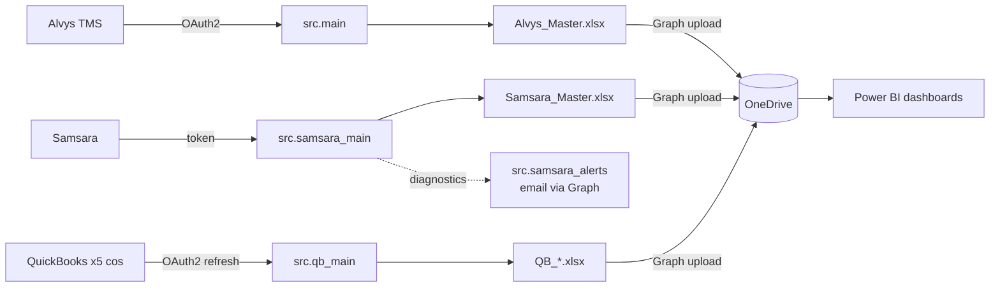

# XFreight Data Pipeline — Knowledge Base

This is the single place to understand **what this repo does, why it's built
this way, and how to operate it.** Read this page first; it gives you the
mental model and points you at the deeper pages.

> **What this repo is, in one sentence:** a set of small Python jobs that pull
> data out of three SaaS systems (Alvys, Samsara, QuickBooks), reshape it into
> Excel files, drop those files in OneDrive, and let Power BI read from there —
> all on an automatic 3×/day schedule run by GitHub Actions.

---

## The mental model

Every data source follows the **same four-step shape**. Once you understand
one connector, you understand all of them:

```
  ┌─────────────┐     ┌──────────────┐     ┌───────────────┐     ┌────────────┐
  │  1. PULL    │ ──▶ │ 2. TRANSFORM │ ──▶ │  3. WRITE     │ ──▶ │ 4. UPLOAD  │
  │  API client │     │  JSON → rows │     │  rows → .xlsx │     │ → OneDrive │
  └─────────────┘     └──────────────┘     └───────────────┘     └────────────┘
        │                                                              │
   auth + paginate                                              Microsoft Graph
```

Then a fifth actor — **Power BI** — reads the Excel files from OneDrive and
draws the dashboards. (There's also an *alternative* path where Power BI calls
the Alvys API directly and skips Excel entirely; see [powerbi.md](./powerbi.md).)



---

## The three data sources at a glance

| Source | What it gives us | Auth style | Entry point | Output |
|--------|------------------|------------|-------------|--------|
| **Alvys** (TMS) | Loads, Trips, Fuel + lots of reference data | OAuth2 client-credentials (Auth0-style) | `python -m src.main` | `Alvys_Master.xlsx` (3 sheets) |
| **Samsara** (telematics) | Vehicles, drivers, GPS, trips, safety, HOS, DVIRs, IFTA | Static API token | `python -m src.samsara_main` | `Samsara_Master.xlsx` (sheet per type) |
| **QuickBooks** (accounting) | P&L, balance sheet, ledgers, aging, customer/vendor lists — for **5 companies** | OAuth2 refresh-token (rotates each run) | `python -m src.qb_main` | one `QB_<report>.xlsx` per report |

All three then run a matching `*_onedrive_upload` step to push the files to OneDrive.

---

## Repository map

```
alvys-pipeline/
├── src/
│   ├── main.py                  # Alvys pipeline orchestrator (PULL→TRANSFORM→WRITE)
│   ├── alvys_client.py          # Alvys API: OAuth + paginated /search endpoints
│   ├── column_mappings.py       # Alvys: which JSON field → which Excel column (874 lines)
│   ├── lookups.py               # Alvys: ID→name reference tables + cross-sheet joins
│   ├── transformers.py          # Alvys: JSON record → DataFrame row engine
│   ├── output_writer.py         # Alvys: DataFrames → Alvys_Master.xlsx (date/int formatting)
│   │
│   ├── samsara_main.py          # Samsara orchestrator
│   ├── samsara_client.py        # Samsara API: cursor pagination
│   ├── samsara_alerts.py        # Samsara: emails fault-code / DVIR-defect alerts
│   │
│   ├── qb_main.py               # QuickBooks orchestrator (loops 5 companies)
│   ├── qb_client.py             # QuickBooks OAuth2 with auto token refresh
│   ├── qb_reports.py            # QuickBooks: report + entity-query definitions/parsers
│   │
│   ├── onedrive_upload.py       # SHARED Microsoft Graph upload helpers (used by all 3)
│   ├── samsara_onedrive_upload.py
│   └── qb_onedrive_upload.py
│
├── .github/workflows/
│   ├── refresh.yml              # Alvys: pull → upload → artifact (3×/day)
│   ├── samsara_refresh.yml      # Samsara: pull → upload → alerts → artifact
│   └── qb_refresh.yml           # QuickBooks: pull → upload → artifact (+ token rotation)
│
├── powerbi/                     # ALTERNATIVE path: Power BI calls Alvys API directly
│   ├── SETUP.md
│   └── queries/*.pq             # Power Query M code
│
├── docs/
│   ├── privacy.html             # privacy policy for the Intuit app registration
│   └── knowledge-base/          # ← you are here
│
├── .env.example                 # credential template for local runs
└── requirements.txt             # requests, pandas, openpyxl, python-dotenv
```

---

## Knowledge base index

| Page | Read it when you want to… |
|------|---------------------------|
| [architecture.md](./architecture.md) | Understand the design decisions and the shared 4-step pattern |
| [connector-alvys.md](./connector-alvys.md) | Work on the Alvys pull, column mappings, or lookups |
| [connector-samsara.md](./connector-samsara.md) | Work on Samsara data or the fleet email alerts |
| [connector-quickbooks.md](./connector-quickbooks.md) | Work on QuickBooks, the 5-company loop, or token rotation |
| [onedrive-and-alerts.md](./onedrive-and-alerts.md) | Understand the OneDrive upload layer and the Azure app registration |
| [automation-and-secrets.md](./automation-and-secrets.md) | Understand the GitHub Actions schedules and every secret/env var |
| [powerbi.md](./powerbi.md) | Understand how Power BI consumes the data (both paths) |
| [rate-per-mile-goal.md](./rate-per-mile-goal.md) | Understand or tune the X-Trux rate-per-mile cost-out goal on the daily brief |
| [operations.md](./operations.md) | Run a job locally, debug a failure, or onboard a new company |

---

## Reality check (state of the world, May 2026)

All three connectors (Alvys, Samsara, QuickBooks), the shared OneDrive upload,
the Samsara alerts, and the 3×/day GitHub Actions schedules are **built and
live**. QuickBooks runs 3 of its 5 companies today (the N&J pair await API
access). The Power BI API-direct path is a working proof of concept, not yet at
full column parity. When in doubt, trust the code and this KB.
